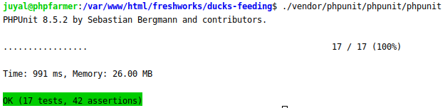

[Go Back](INDEX.md)

## Testing via PHPUnit
You can check the official laravel testing guide here. [Database Testing](https://laravel.com/docs/5.2/testing)

I've put the env.testing file intentionally so that you can just use it, just make sure you have created a testing database and updated this env.testing file properly.

Run the automated testing

    ./vendor/phpunit/phpunit/phpunit

It supposed to show you at least `17 tests, 42 assertions` which has Unit and Feature tests all together as shown on below screenshot. 

